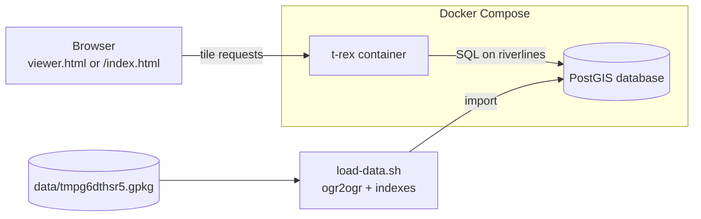
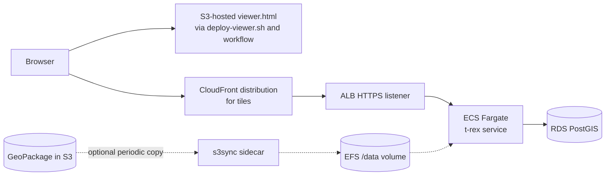
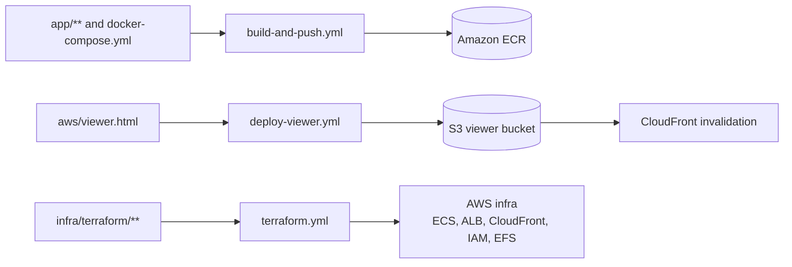

# Architecture Overview

This repository packages a vector-tile delivery stack for river-line data. The core runtime contract is simple: a browser requests tiles and metadata from t-rex, and t-rex queries PostGIS for geometry and attributes.

## Scope

- Source data: a GeoPackage stored in the repo, or a PostGIS database populated from that GeoPackage.
- Runtime serving: t-rex in Docker for local development, and t-rex on ECS Fargate behind an ALB in AWS.
- Viewer: MapLibre GL JS HTML that reads the tile endpoint and renders the river layer.
- Infrastructure: Terraform for ECS, ALB, CloudFront, IAM, and optional EFS-backed GeoPackage sync.

## Major Interfaces

- Tile endpoint: `/riverlines/{z}/{x}/{y}.pbf`
- Tile metadata: `/riverlines.json`
- Local viewer: `/index.html` served by t-rex, plus `viewer.html` for standalone local testing
- Data source: PostGIS `riverlines` table, with zoom-tiered attribute selection in the t-rex query layer
- Deployment inputs: VPC and subnet IDs, TLS certificate ARNs, domain name, Postgres connection string, and optional GeoPackage S3 location

## Runtime Topology

### Local Development

The local path is the clearest end-to-end flow in the repo:

1. `docker-compose.yml` starts PostGIS and t-rex.
2. `load-data.sh` loads `data/tmpg6dthsr5.gpkg` into the `riverlines` table and creates a basic index.
3. The viewer is served from the t-rex container, and tile requests go back to the same container.

The local topology is shown in [local-runtime.mmd](diagrams/local-runtime.mmd).

### AWS Production

The intended production path is:

1. A browser loads the viewer HTML.
2. Tile requests go through CloudFront to an ALB HTTPS listener.
3. The ALB forwards to an ECS Fargate task running t-rex.
4. t-rex queries RDS PostGIS for feature data.

An optional GeoPackage sync path exists in Terraform: a sidecar copies a GeoPackage from S3 into EFS on a timer when `gpkg_bucket` and `gpkg_key` are set.

The production topology is shown in [production-topology.mmd](diagrams/production-topology.mmd).

## Data Flow

The repository supports two data-loading shapes:

1. Local ingest: `load-data.sh` uses GDAL `ogr2ogr` to import the sample GeoPackage into the local PostGIS container.
2. Remote ingest: `scripts/gpkg_to_postgis.sh` and `scripts/create_postgis_indexes.sql` provide a separate PostGIS loading path for non-local databases.

At query time, t-rex uses zoom-tiered SQL to reduce the amount of data shipped into tiles at low zooms. The viewer then uses `streamorder` for zoom-based filtering and `relativevalues95thpercentile` for color classification.

## Control Plane

Three GitHub Actions workflows drive the repo:

- `build-and-push.yml` builds the t-rex image and pushes it to ECR.
- `deploy-viewer.yml` updates `aws/viewer.html`, uploads it to S3, and optionally invalidates CloudFront.
- `terraform.yml` validates and applies the AWS infrastructure.

The CI/CD flow is shown in [ci-cd.mmd](diagrams/ci-cd.mmd).

## Failure Modes And Operational Constraints

- t-rex cannot start without a valid Postgres connection string.
- Local startup depends on PostGIS becoming healthy before t-rex begins serving.
- CloudFront caches tiles and the viewer for a bounded time, so stale content can persist until TTL expiry or invalidation.
- The optional GeoPackage sync path is eventually consistent because it updates on a timer rather than on every change.
- Terraform requires the caller to supply network, certificate, and database inputs; the repo does not provision the VPC or RDS instance itself.

## Architectural Notes

- The repo contains both a static t-rex config (`app/trex-config.toml`) and a templated config plus entrypoint (`app/trex-config.template.toml`, `app/entrypoint.sh`). The current Dockerfile builds the static config path, while the ECS task definition expects the templated entrypoint path. That split should be reconciled before treating the AWS path as fully wired.
- `aws/README.md` describes a combined viewer-and-tiles CloudFront setup, but `infra/terraform/cloudfront.tf` currently provisions CloudFront for the tile origin only. Viewer deployment is handled separately through the S3 upload script and workflow.

## Information Requested

- TBD: Should the canonical production viewer live on the same CloudFront distribution as the tiles, or should viewer hosting remain a separate S3-backed deployment?
- TBD: Should the ECS image use the static `app/trex-config.toml` path, or should the Dockerfile be updated to ship the templated entrypoint flow?
- TBD: Is the optional GeoPackage-on-S3/EFS path a supported production mode, or only a migration convenience?

## Diagrams

Local runtime topology for docker-compose development

- [Local runtime](diagrams/local-runtime.mmd)

AWS production topology for tiles and viewer delivery

- [Production topology](diagrams/production-topology.mmd)

- [CI/CD flow](diagrams/ci-cd.mmd)

Github Actions delivery flow

---
<small>Generated with GitHub Copilot as directed by tilmann</small>